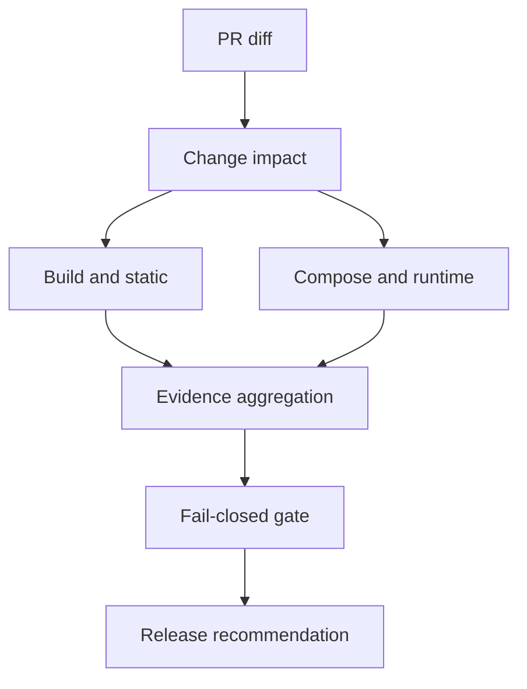

# HULK SA Quality Engineering Lab — architecture

## Purpose

The Quality Engineering Lab is the repository quality gate. The existing Compatibility Lab is
preserved as its black-box runtime engine; it is not duplicated or replaced. Every result must be
traceable to a commit, device profile, case, and artifact. Missing evidence is `BLOCKED`, never
`PASS`.

## Layers

| Layer | Implementation | Current state |
|---|---|---|
| Repository intelligence | `qa/quality/inventory/pr_inventory.py` | Implemented; paginated PR inventory |
| PR impact | `qa/quality/impact/classifier.py` | Implemented; unknown changes select full matrix |
| Source/build/static | `quality-pr.yml`, canonical hash, logo hash | Implemented; CI execution pending on this branch |
| Unit/domain | Existing Gradle tests + Python self-tests | Implemented |
| Compose/instrumentation | `MainShellComposeQualityTest`, `CompatibilitySmokeTest` | Implemented; CI execution pending |
| Black-box runtime | `qa/compatibility` | Preserved and upgraded |
| Visual regression | runtime screenshots + `visual/compare.py` + geometry assertions | Engine implemented; no approved post-upgrade baseline yet |
| Navigation/focus graph | runtime traces + `journeys/graph_audit.py` | Partial; shell covered, details/player gaps explicit |
| Accessibility | runtime XML `accessibility/audit.py` | Implemented for labels/targets/state; contrast/TalkBack need device review |
| Lifecycle | Activity recreation/background instrumentation | Partial |
| Network/offline | loopback MockWebServer download fixture | Partial; full response matrix not yet executed |
| Downloads | production `DownloadRepository` instrumentation + evidence analyzer | Positive bytes/integrity test implemented; reboot not executed |
| Playback | existing unit behavior | Fixture-driven Media3 runtime not executed |
| Performance | capture of `gfxinfo`, `meminfo`, launch timing | Advisory only; physical Macrobenchmark not executed |
| Release | runtime config, ABI, signature, bundle/upgrade workflows | Implemented; protected execution pending |
| Physical devices | protected artifact contract and runbook | Ready; no connected device provider |
| Reporting | `qa/quality/reporters/aggregate.py` | Mandatory nine-file contract plus checksums |

## Execution flow

The final enforcement job depends on every evidence-producing job. `continue-on-error` is limited
to emulator capture attempts; the device and aggregate gates still fail. The first failed attempt
is retained under `attempts/attempt-1`.

## Trust boundaries

- PR workflows have read-only repository access and no signing or production credentials.
- Production signing is available only through the `production-signing` environment.
- Fixture authentication is deterministic and does not claim production E2E.
- Physical/OEM/ARM results require external artifacts that identify the physical device.
- Logo assets are immutable inputs. `approved-logo-assets.sha256` is a critical gate.

